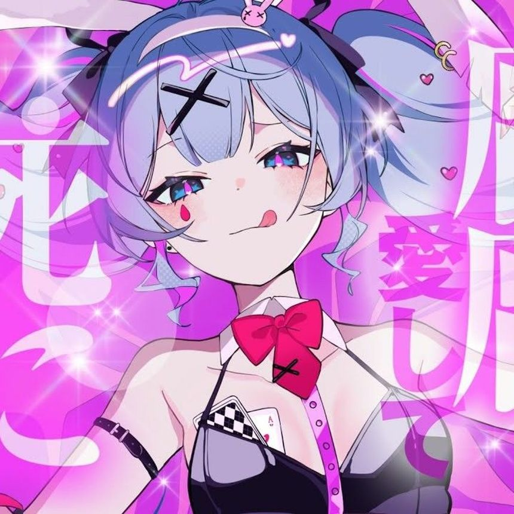

  

<h1 align="center" style="background: linear-gradient(90deg, #7c3aed, #ec4899, #06b6d4, #f59e0b, #7c3aed); background-size: 200% auto; -webkit-background-clip: text; -webkit-text-fill-color: transparent; font-size: 3.5em; font-weight: 900; letter-spacing: 4px; text-transform: uppercase;">
  AGUITA
</h1>

  

  
  
  
  
  
  
  

  
  

---

<table align="center" width="100%" border="0" cellpadding="0" cellspacing="0">
  <tr>
    <td align="center">
      
      
    </td>
  </tr>
  <tr>
    <td align="center" style="padding-top: 20px;">
      
    </td>
  </tr>
</table>

---

  <h2 style="color: #7c3aed; border-bottom: 2px solid #7c3aed; padding-bottom: 8px; display: inline-block;">About Me</h2>

  Full-stack developer and ML engineer based in Mexico. 
  Passionate about building scalable applications, advanced AI systems, and next-generation machine learning models. 
  Currently focused on developing efficient LLM architectures, cryptographic systems, and AI benchmarking tools.

<table align="center" width="80%" border="0" cellpadding="15">
  <tr>
    <td align="center" style="border: 1px solid #7c3aed; border-radius: 10px; background: rgba(124, 58, 237, 0.05);">
      <strong style="color: #06b6d4; font-size: 14px;">Hardware</strong> 
      Snapdragon 685, 8GB RAM
    </td>
    <td align="center" style="border: 1px solid #ec4899; border-radius: 10px; background: rgba(236, 72, 153, 0.05);">
      <strong style="color: #f59e0b; font-size: 14px;">Operating Systems</strong> 
      Artix, Arch Linux, Debian, Fedora
    </td>
  </tr>
</table>

---

  <h2 style="color: #ec4899; border-bottom: 2px solid #ec4899; padding-bottom: 8px; display: inline-block;">Core Specializations</h2>

<table align="center" width="90%" border="0" cellpadding="8">
  <tr>
    <td align="center"></td>
    <td align="center"></td>
  </tr>
  <tr>
    <td align="center"></td>
    <td align="center"></td>
  </tr>
  <tr>
    <td align="center" colspan="2"></td>
  </tr>
</table>

---

  <h2 style="color: #06b6d4; border-bottom: 2px solid #06b6d4; padding-bottom: 8px; display: inline-block;">Technical Stack</h2>

<table align="center" width="100%" border="0" cellpadding="12">
  <tr>
    <td align="center" style="border: 1px solid #7c3aed; border-radius: 12px;">
      <h3 style="color: #7c3aed; margin: 10px 0;">Languages</h3>
      
      
      
      
      
      
      
    </td>
  </tr>
  <tr>
    <td align="center" style="border: 1px solid #ec4899; border-radius: 12px;">
      <h3 style="color: #ec4899; margin: 10px 0;">Web & Frameworks</h3>
      
      
      
      
    </td>
  </tr>
  <tr>
    <td align="center" style="border: 1px solid #f59e0b; border-radius: 12px;">
      <h3 style="color: #f59e0b; margin: 10px 0;">Machine Learning & AI</h3>
      
      
      
      
      
    </td>
  </tr>
  <tr>
    <td align="center" style="border: 1px solid #10b981; border-radius: 12px;">
      <h3 style="color: #10b981; margin: 10px 0;">Databases & DevOps</h3>
      
      
      
      
      
    </td>
  </tr>
</table>

---

  <h2 style="color: #f59e0b; border-bottom: 2px solid #f59e0b; padding-bottom: 8px; display: inline-block;">Activity & Stats</h2>

  

  

---

  <h2 style="color: #7c3aed; border-bottom: 2px solid #7c3aed; padding-bottom: 8px; display: inline-block;">WakaTime Stats</h2>

  

---

  <h2 style="color: #ec4899; border-bottom: 2px solid #ec4899; padding-bottom: 8px; display: inline-block;">Now Vibing</h2>

<table align="center" width="60%" border="0" cellpadding="20">
  <tr>
    <td align="center" style="border: 2px solid #7c3aed; border-radius: 16px; background: linear-gradient(135deg, rgba(124, 58, 237, 0.1), rgba(236, 72, 153, 0.1));">
      
      

        <strong style="color: #7c3aed; font-size: 20px;">Rabbit Hole</strong> 
        DECO*27
      

      
    </td>
  </tr>
</table>

---

  <h2 style="color: #06b6d4; border-bottom: 2px solid #06b6d4; padding-bottom: 8px; display: inline-block;">Contact</h2>

  
  
  

---

  

  Designed with precision. Powered by passion.

