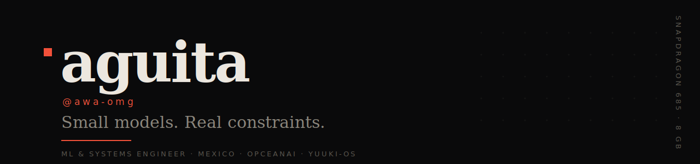

<!--
  Profile README for @awa-omg.
  Design: one deliberate palette (ink / bone / a single coral accent), a bespoke
  theme-aware banner, and restraint. GitHub strips inline `style=`, so all styling
  lives in the committed SVG banner and in themed image params — never in CSS.
  Keep it that way.
-->

<div align="center">

<picture>
  <source media="(prefers-color-scheme: dark)"  srcset="assets/banner-dark.svg">
  <source media="(prefers-color-scheme: light)" srcset="assets/banner-light.svg">
  
</picture>

<br><br>

<a href="https://github.com/OpceanAI"></a>
<a href="https://github.com/YuuKi-OS"></a>
<a href="https://huggingface.co/OpceanAI"></a>
<a href="mailto:aguitachan3@gmail.com"></a>

</div>

<br>

Machine-learning and systems engineer from **Mexico**. I build language models, container
runtimes, and low-level tools that have to run on an **8&nbsp;GB phone**, not a datacenter.
That constraint is the point: it keeps the work small, honest, and fast. Founder of
**[OpceanAI](https://github.com/OpceanAI)** and **[YuuKi-OS](https://github.com/YuuKi-OS)**.

```text
focus     small LLMs · container runtimes · local-first tooling · cryptography
approach  mobile-first, resource-aware, trained/written from scratch
daily     Snapdragon 685 · 8 GB RAM · Artix / Arch / Debian / Fedora
```

<br>

## Selected work

**OpceanAI**

- [**Doki**](https://github.com/OpceanAI/Doki) &nbsp;`Go`&nbsp; · &nbsp;★&nbsp;19 — Universal containers, zero friction. Rootless, Docker &amp; Podman compatible, and it runs natively on Android.
- [**openllava**](https://github.com/OpceanAI/openllava) &nbsp;`Python`&nbsp; — Inject vision into any language model. CUDA, ROCm, TPU, MLX, XPU, CPU. Train, serve, export.
- [**Shadow**](https://github.com/OpceanAI/Shadow) &nbsp;`TypeScript`&nbsp; — A local-first CLI that reads, traces, tests, and explains code. Zero bytes to the cloud.

**YuuKi-OS**

- [**Yuuki-82M**](https://github.com/YuuKi-OS/yuuki-training) &nbsp;`Python`&nbsp; — An 82M-parameter language model trained from scratch, mobile-first and resource-aware.

**Personal**

- [**bad-apple-tcp**](https://github.com/awa-omg/bad-apple-tcp) &nbsp;`C`&nbsp; — Bad Apple as ASCII, streamed frame-by-frame over raw TCP sockets.
- [**Koesu**](https://github.com/awa-omg/Koesu) &nbsp;`Makefile`&nbsp; — A Discord music bot with Dave (E2EE) and Lavalink support, built to stay up.
- [**vulkan-apple**](https://github.com/awa-omg/vulkan-apple) &nbsp;`C++`&nbsp; — Low-level Vulkan graphics and GPU-compute experiments.

<br>

## Stack

```text
Languages   Python · Rust · Go · TypeScript · C / C++ · Kotlin · Bash
ML          PyTorch · from-scratch training · quantization · benchmarking (NHE)
Systems     Linux · containers (OCI / rootless) · PRoot · Vulkan · networking
Web         Next.js · React · Tailwind · Node
```

<br>

## Measured

<div align="center">

<!-- Themed to the palette (transparent bg adapts to light/dark), no trophies, no streak theatre. -->

&nbsp;&nbsp;


</div>

<br>

<details>
<summary><b>More — organizations &amp; other projects</b></summary>

<br>

**Organizations** — [OpceanAI](https://github.com/OpceanAI) (AI &amp; ML) · [YuuKi-OS](https://github.com/YuuKi-OS) (operating systems &amp; tooling)

**Also built**
- [Doki-web](https://github.com/OpceanAI/Doki-web) `TypeScript` — the official Doki site (Next.js 16 · React 19 · Tailwind 4).
- [bad-apple-git](https://github.com/awa-omg/bad-apple-git) `Python` — Bad Apple rendered in git commit history.
- [aguita.site](https://github.com/awa-omg/aguita.site) `TypeScript` — personal site.

</details>

<br>

---

<div align="center">

**Small models. Real constraints.**

<sub>Reach me at <a href="mailto:aguitachan3@gmail.com">aguitachan3@gmail.com</a> · <a href="mailto:contact@opceanai.com">contact@opceanai.com</a></sub>

</div>
