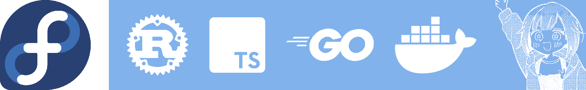

  

<h1 align="center" style="background: linear-gradient(90deg, #7c3aed, #ec4899, #06b6d4, #f59e0b); -webkit-background-clip: text; -webkit-text-fill-color: transparent; background-clip: text; font-size: 3em; font-weight: 900; letter-spacing: -1px;">
  AGUITA
</h1>

  

  
  
  
  
  
  
  

  
  
  
  

  

<h2 align="center" style="color: #7c3aed;">About Me</h2>

<blockquote style="border-left: 4px solid #7c3aed; background: linear-gradient(135deg, rgba(124, 58, 237, 0.08), rgba(236, 72, 153, 0.05)); padding: 24px; border-radius: 12px; margin: 0 20px;">
  

    Full-stack developer and ML engineer based in Mexico. 
    Passionate about building scalable applications, advanced AI systems, and next-generation machine learning models. 
    Currently focused on developing efficient LLM architectures, cryptographic systems, and AI benchmarking tools.
  

</blockquote>

<table align="center" width="90%">
  <tr>
    <td align="center" style="border: 1px solid #7c3aed; border-radius: 12px; padding: 16px; background: rgba(124, 58, 237, 0.05);">
      <strong style="color: #06b6d4; font-size: 14px;">Hardware</strong> 
      Snapdragon 685, 8GB RAM
    </td>
    <td align="center" style="border: 1px solid #ec4899; border-radius: 12px; padding: 16px; background: rgba(236, 72, 153, 0.05);">
      <strong style="color: #f59e0b; font-size: 14px;">Operating Systems</strong> 
      Artix, Arch Linux, Debian, Fedora
    </td>
    <td align="center" style="border: 1px solid #06b6d4; border-radius: 12px; padding: 16px; background: rgba(6, 182, 212, 0.05);">
      <strong style="color: #10b981; font-size: 14px;">Focus Areas</strong> 
      LLMs, Crypto, AI Systems
    </td>
  </tr>
</table>

  

<h2 align="center" style="color: #ec4899;">GitHub Statistics</h2>

  

  

  

<h3 align="center" style="color: #ec4899;">Trophies</h3>

  

<h3 align="center" style="color: #06b6d4;">Full Metrics</h3>

  

  

<h2 align="center" style="color: #06b6d4;">Pinned Repositories</h2>

<table align="center" width="95%">
  <tr>
    <td width="33%" style="padding: 14px; border: 2px solid #7c3aed; border-radius: 14px; background: linear-gradient(135deg, rgba(124, 58, 237, 0.1), rgba(124, 58, 237, 0.02));">
      <h3 style="color: #7c3aed; margin-top: 0; margin-bottom: 8px;">
         Koesu
      </h3>
      
Discord music bot with Dave and Lavalink support

      

        
        
      

      
    </td>
    <td width="33%" style="padding: 14px; border: 2px solid #ec4899; border-radius: 14px; background: linear-gradient(135deg, rgba(236, 72, 153, 0.1), rgba(236, 72, 153, 0.02));">
      <h3 style="color: #ec4899; margin-top: 0; margin-bottom: 8px;">
         aguita.site
      </h3>
      
Personal website and portfolio

      

        
      

      
    </td>
    <td width="33%" style="padding: 14px; border: 2px solid #06b6d4; border-radius: 14px; background: linear-gradient(135deg, rgba(6, 182, 212, 0.1), rgba(6, 182, 212, 0.02));">
      <h3 style="color: #06b6d4; margin-top: 0; margin-bottom: 8px;">
         bad-apple-git
      </h3>
      
Bad Apple in git commit history

      

        
        
      

      
    </td>
  </tr>
</table>

  

<h2 align="center" style="color: #7c3aed;">Organizations</h2>

<table align="center" width="80%">
  <tr>
    <td align="center" style="border: 2px solid #7c3aed; border-radius: 16px; padding: 20px; background: linear-gradient(135deg, rgba(124, 58, 237, 0.08), rgba(124, 58, 237, 0.02));">
      
      <h3 style="color: #7c3aed; margin: 12px 0 8px;">OpceanAI</h3>
      
AI & Machine Learning Organization

      

        
        
      

      
    </td>
    <td align="center" style="border: 2px solid #ec4899; border-radius: 16px; padding: 20px; background: linear-gradient(135deg, rgba(236, 72, 153, 0.08), rgba(236, 72, 153, 0.02));">
      
      <h3 style="color: #ec4899; margin: 12px 0 8px;">YuuKi-OS</h3>
      
Operating Systems & Tools

      

        
        
      

      
    </td>
  </tr>
</table>

  

<h2 align="center" style="color: #06b6d4;">OpceanAI Repositories</h2>

<table align="center" width="95%">
  <tr>
    <td width="50%" style="padding: 14px; border: 1px solid #7c3aed; border-radius: 14px; background: linear-gradient(135deg, rgba(124, 58, 237, 0.06), rgba(124, 58, 237, 0.02));">
      <h3 style="color: #7c3aed; margin-top: 0; margin-bottom: 8px;">
        
        
        Doki
      </h3>
      
Universal containers, zero friction. Docker & Podman compatible. Rootless. Runs anywhere.

      

        
      

      
    </td>
    <td width="50%" style="padding: 14px; border: 1px solid #ec4899; border-radius: 14px; background: linear-gradient(135deg, rgba(236, 72, 153, 0.06), rgba(236, 72, 153, 0.02));">
      <h3 style="color: #ec4899; margin-top: 0; margin-bottom: 8px;">
        
        Doki-web
      </h3>
      
Official website for Doki. Next.js 16 + React 19 + Tailwind CSS 4 landing page.

      

        
      

      
    </td>
  </tr>
  <tr>
    <td width="50%" style="padding: 14px; border: 1px solid #06b6d4; border-radius: 14px; background: linear-gradient(135deg, rgba(6, 182, 212, 0.06), rgba(6, 182, 212, 0.02));">
      <h3 style="color: #06b6d4; margin-top: 0; margin-bottom: 8px;">
        
        openllava
      </h3>
      
Inject vision into any language model — CUDA, ROCm, TPU, MLX, XPU and CPU. Train, serve, export.

      

        
      

      
    </td>
    <td width="50%" style="padding: 14px; border: 1px solid #f59e0b; border-radius: 14px; background: linear-gradient(135deg, rgba(245, 158, 11, 0.06), rgba(245, 158, 11, 0.02));">
      <h3 style="color: #f59e0b; margin-top: 0; margin-bottom: 8px;">
        
        Shadow
      </h3>
      
Local-first CLI that reads, traces, tests, and explains code. Turns confusion into clarity without sending bytes to the cloud.

      

        
      

      
    </td>
  </tr>
  <tr>
    <td width="50%" style="padding: 14px; border: 1px solid #10b981; border-radius: 14px; background: linear-gradient(135deg, rgba(16, 185, 129, 0.06), rgba(16, 185, 129, 0.02));">
      <h3 style="color: #10b981; margin-top: 0; margin-bottom: 8px;">
        
        Doki-proot
      </h3>
      
PRoot implementation for Doki container engine.

      
    </td>
    <td width="50%" style="padding: 14px; border: 1px solid #7c3aed; border-radius: 14px; background: linear-gradient(135deg, rgba(124, 58, 237, 0.06), rgba(124, 58, 237, 0.02));">
      <h3 style="color: #7c3aed; margin-top: 0; margin-bottom: 8px;">
        
        opceanai
      </h3>
      
OpceanAI organization profile and resources.

      
    </td>
  </tr>
</table>

  

<h2 align="center" style="color: #ec4899;">YuuKi-OS Repositories</h2>

<table align="center" width="95%">
  <tr>
    <td width="50%" style="padding: 14px; border: 1px solid #ec4899; border-radius: 14px; background: linear-gradient(135deg, rgba(236, 72, 153, 0.06), rgba(236, 72, 153, 0.02));">
      <h3 style="color: #ec4899; margin-top: 0; margin-bottom: 8px;">
        
        
        yuuki-training
      </h3>
      
Training and experimentation code for Yuuki-82M, a small language model trained from scratch with a mobile-first, resource-aware approach.

      

        
      

      
    </td>
    <td width="50%" style="padding: 14px; border: 1px solid #06b6d4; border-radius: 14px; background: linear-gradient(135deg, rgba(6, 182, 212, 0.06), rgba(6, 182, 212, 0.02));">
      <h3 style="color: #06b6d4; margin-top: 0; margin-bottom: 8px;">
        
        Yuuki-wev
      </h3>
      
Yuuki web interface and tools.

      

        
      

      
    </td>
  </tr>
</table>

  

<h2 align="center" style="color: #7c3aed;">Currently Building</h2>

<table align="center" width="90%">
  <tr>
    <td width="50%" style="padding: 12px; border: 1px solid #7c3aed; border-radius: 12px; background: rgba(124, 58, 237, 0.05);">
      

        
        <strong style="color: #7c3aed;">AI Systems Architecture</strong> 
        Designing efficient LLM pipelines and benchmarking tools
      

    </td>
    <td width="50%" style="padding: 12px; border: 1px solid #ec4899; border-radius: 12px; background: rgba(236, 72, 153, 0.05);">
      

        
        <strong style="color: #ec4899;">Cryptographic Systems</strong> 
        Building secure encryption protocols and key management
      

    </td>
  </tr>
  <tr>
    <td width="50%" style="padding: 12px; border: 1px solid #06b6d4; border-radius: 12px; background: rgba(6, 182, 212, 0.05);">
      

        
        <strong style="color: #06b6d4;">ML Model Optimization</strong> 
        Researching quantization and pruning techniques
      

    </td>
    <td width="50%" style="padding: 12px; border: 1px solid #f59e0b; border-radius: 12px; background: rgba(245, 158, 11, 0.05);">
      

        
        <strong style="color: #f59e0b;">Open Source Contributions</strong> 
        Contributing to community projects and tools
      

    </td>
  </tr>
</table>

  

<h2 align="center" style="color: #ec4899;">Core Specializations</h2>

  
  
  
  
  

  

<h2 align="center" style="color: #06b6d4;">Technical Stack</h2>

  

  

  

<h3 align="center" style="color: #ec4899;">Web & Frameworks</h3>

  

<h3 align="center" style="color: #f59e0b;">Machine Learning & AI</h3>

  

<h3 align="center" style="color: #10b981;">Databases & DevOps</h3>

  

<h3 align="center" style="color: #7c3aed;">Tools & Platforms</h3>

  

  

<h2 align="center" style="color: #f59e0b;">Other Projects</h2>

<table align="center" width="95%">
  <tr>
    <td width="50%" style="padding: 14px; border: 1px solid #06b6d4; border-radius: 14px; background: linear-gradient(135deg, rgba(6, 182, 212, 0.06), rgba(6, 182, 212, 0.02));">
      <h3 style="color: #06b6d4; margin-top: 0; margin-bottom: 8px;">bad-apple-tcp</h3>
      
Bad Apple terminal rendering over TCP. Real-time ASCII animation streaming via network sockets.

      

        
        
      

      
    </td>
    <td width="50%" style="padding: 14px; border: 1px solid #10b981; border-radius: 14px; background: linear-gradient(135deg, rgba(16, 185, 129, 0.06), rgba(16, 185, 129, 0.02));">
      <h3 style="color: #10b981; margin-top: 0; margin-bottom: 8px;">Doki-wiki</h3>
      
Doki container engine wiki documentation. Comprehensive guides and API references.

      

        
      

      
    </td>
  </tr>
  <tr>
    <td width="50%" style="padding: 14px; border: 1px solid #7c3aed; border-radius: 14px; background: linear-gradient(135deg, rgba(124, 58, 237, 0.06), rgba(124, 58, 237, 0.02));">
      <h3 style="color: #7c3aed; margin-top: 0; margin-bottom: 8px;">vulkan-apple</h3>
      
Vulkan graphics experiments. Low-level rendering and GPU compute exploration.

      

        
      

      
    </td>
    <td width="50%" style="padding: 14px; border: 1px solid #ec4899; border-radius: 14px; background: linear-gradient(135deg, rgba(236, 72, 153, 0.06), rgba(236, 72, 153, 0.02));">
      <h3 style="color: #ec4899; margin-top: 0; margin-bottom: 8px;">Yuuki-web</h3>
      
Yuuki web interface project.

      

        
        
      

      
    </td>
  </tr>
</table>

  

<h2 align="center" style="color: #ec4899;">Now Vibing</h2>

<table align="center" width="60%">
  <tr>
    <td align="center" style="border: 2px solid #7c3aed; border-radius: 16px; padding: 24px; background: linear-gradient(135deg, rgba(124, 58, 237, 0.1), rgba(236, 72, 153, 0.08));">
      
      

        <strong style="color: #7c3aed; font-size: 20px;">Rabbit Hole</strong> 
        DECO*27
      

      
    </td>
  </tr>
</table>

  

<h2 align="center" style="color: #06b6d4;">Contact</h2>

  
  
  

  

  

  Designed with precision. Powered by passion.

